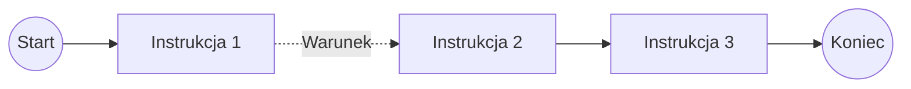

# Zakładka - Proces

Zakładka **Proces** służy do definiowania diagramu (algorytmu) procesu.

Diagram składa się z punktów połączonych jednokierunkowymi przejściami. Każde przejście może zawierać warunek decydujący o wykonaniu kolejnego kroku. Brak warunku oznacza przejście bezwarunkowe. 

Ścieżka algorytmu to kroki wykonywane od punktu startu do punktu końca. Algorytm może zawierać  ścieżek.

Dostępne elementy diagramu:

- **Punkty startu**,
- **Instrukcje**,
- **Punkt końca**.

Każdy algorytm powinien zawierać co najmniej:

- jeden punkt startu,
- jedną instrukcję,
- jeden punkt końca.



## Punkty startu

Punkt startu określa zdarzenie uruchamiające algorytm.

Dostępne typy:

- **Click** - uruchamia algorytm po użyciu wyzwalacza. Jeżeli algorytm jest przypisany do klasy, reaguje na wyzwalacze tej klasy.
- **Before** - uruchamia algorytm po zmianie wartości, przed jej walidacją.
- **After** - uruchamia algorytm po zmianie wartości, po poprawnej walidacji. :contentReference[oaicite:1]{index=1}

## Instrukcje

Instrukcja reprezentuje pojedynczą operację wykonywaną w algorytmie.

Każda instrukcja zawiera wspólne właściwości:

- `Nazwa` - Kod instrukcji.

:::warning
Nazwa musi być unikatowa w ramach całej bazy. Nie wolno stosować znaków narodowych i specjalnych. Dozwolone są znaki `A-Z`, `_` i `-`.
:::

- `Opis` - Opis instrukcji widoczny w panelu administracyjnym.
- `Zmienna` - Zmienna wejściowa lub wyjściowa używana przez instrukcję.

W zależności od typu instrukcji dostępne są dodatkowe właściwości.

Dostępne typy instrukcji:

- **Obsługa linii dokumentu**,
- **Obsługa skryptu**,
- **Okno komunikatu**,
- **Wykonanie DLL**.

Instrukcje mogą odczytywać dane ze zmiennych lub zapisywać do nich wynik operacji.

### Obsługa linii dokumentu

Instrukcja **Obsługa linii dokumentu** wykonuje operacje na nagłówku lub liniach dokumentu.


Dodatkowa właściwość:

- `Typ rozkazu` - Określa operację wykonywaną na dokumencie.

Dostępne typy rozkazu:

#### Dodanie linii

Dodaje nową linię dokumentu na podstawie danych przekazanych w zmiennej.

Nazwy kolumn w zmiennej powinny odpowiadać nazwom atrybutów linii dokumentu.

#### Czyszczenie linii

Usuwa wszystkie linie dokumentu.

Instrukcja nie wymaga przekazania danych linii w zmiennej.

#### Kasowanie linii

Usuwa wskazaną linię dokumentu.

Numer linii jest przekazywany w kolumnie systemowej:

- `SYS_LINEID` - ID linii przeznaczonej do usunięcia.

#### Pobranie linii

Pobiera aktualne linie dokumentu do zmiennej tabelarycznej.

Kolumny zmiennej odpowiadają atrybutom linii. Dodatkowo zwracane jest pole systemowe:

| Pole | Opis |
| --- | --- |
| `SYS_LINEID` | ID linii dokumentu |

#### Aktualizacja linii

Aktualizuje wartości atrybutów istniejących linii dokumentu.

Zmienna wejściowa powinna zawierać:

- `SYS_LINEID` - ID aktualizowanej linii,
- kolumny odpowiadające atrybutom, które mają zostać zmienione.

Nie jest wymagane przekazywanie wszystkich atrybutów linii.

#### Pobranie nagłówka

Pobiera dane nagłówka dokumentu do zmiennej tabelarycznej zawierającej jeden wiersz.

Oprócz atrybutów nagłówka zwracane są pola systemowe:

| Pole | Opis |
| --- | --- |
| `SYS_ID` | ID dokumentu. |
| `SYS_USERID` | ID użytkownika. |
| `SYS_CLASSID` | ID klasy. |
| `SYS_COMPANYID` | ID firmy. |
| `SYS_TEMPLATEID` | ID szablonu. |
| `SYS_NAME` | Nazwa dokumentu. |
| `SYS_DESCRIPTION` | Opis dokumentu. |
| `SYS_DOCDATE` | Data dokumentu. |
| `SYS_ENTERDATE` | Data wpływu. |
| `SYS_DOCNUM` | Numer dokumentu. |

#### Aktualizacja nagłówka

Aktualizuje atrybuty oraz wybrane pola systemowe nagłówka dokumentu.

Nie jest wymagane przekazywanie wszystkich pól. Zmienna może zawierać wyłącznie wartości przeznaczone do aktualizacji.

Obsługiwane pola systemowe:

| Pole | Opis |
| --- | --- |
| `SYS_NAME` | Nazwa dokumentu. |
| `SYS_DESCRIPTION` | Opis dokumentu. |
| `SYS_DOCDATE` | Data dokumentu. |
| `SYS_ENTERDATE` | Data wpływu. |
| `SYS_DOCNUM` | Numer dokumentu. |

#### Zapisz dokument

Zapisuje zmiany wykonane na dokumencie przez wcześniejsze instrukcje algorytmu.

#### Dodanie referencji

Dodaje nową referencję do dokumentu.

Zmienna wejściowa musi zawierać pola:

- `SYS_ID` - identyfikator dokumentu SPUMA,
- `SYS_OBJECTTYPE` - typ dokumentu SAP (`ObjType`),
- `SYS_OBJECTID` - numer wewnętrzny dokumentu SAP (`DocEntry`).

#### Czyszczenie referencji

Usuwa wszystkie referencje przypisane do dokumentu.

#### Kasowanie referencji

Usuwa wskazaną referencję dokumentu.

Referencja przeznaczona do usunięcia powinna zostać wskazana na podstawie danych przekazanych w zmiennej, np. identyfikatora referencji `SYS_INT_ID`.

#### Pobranie referencji

 Pobiera dane referencji dokumentu powiązanego z dokumentem w SAP. Wynik jest zapisywany do zmiennej tabelarycznej.

  Zwracane kolumny systemowe:

| Kolumna | Opis |
| --- | --- |
| `SYS_INT_ID` | Identyfikator wewnętrzny referencji. |
| `SYS_COMPANYID` | Identyfikator firmy. |
| `SYS_OBJECTTYPE` | Typ dokumentu SAP (`ObjType`). |
| `SYS_OBJECTID` | Numer wewnętrzny dokumentu SAP (`DocEntry`). |
| `SYS_BOBJECTTYPE` | Typ bazowego dokumentu SAP (`ObjType`), do którego odnosi się dokument. |
| `SYS_BOBJECTID` | Numer wewnętrzny bazowego dokumentu SAP (`DocEntry`). |
| `SYS_ISISYS` | Informacja, czy referencja została utworzona systemowo. Wartość `1` oznacza referencję utworzoną automatycznie, np. przez mechanizm **Księguj do SAP** lub na podstawie dokumentu bazowego. |

#### Aktualizacja referencji

Aktualizuje wskazaną referencję dokumentu.

Zmienna wejściowa musi zawierać pole:

- `SYS_INT_ID` - identyfikator wewnętrzny referencji przeznaczonej do aktualizacji.

Pozostałe kolumny przekazane w zmiennej określają wartości, które mają zostać zaktualizowane.

### Obsługa skryptu

Instrukcja **Obsługa skryptu** wykonuje zapytanie SQL i zapisuje jego wynik do zmiennej tabelarycznej.

Właściwości:

- `Typ skryptu` - Typ połączenia z bazą danych.
- `Skrypt` - Treść zapytania SQL.

Przy tworzeniu zapytania należy pamiętać, że mamy dostęp do zmiennych całego procesu. Przechowywane są one w tablicach tymczasowych:
  ```text
  #NAZWA_ZMIENNEJ
  ```

  Przykładowo zmienna `HDR` jest dostępna jako:

  ```sql
  #HDR
  ```

### Komunikat

Instrukcja **Komunikat** wyświetla użytkownikowi okno z informacją lub wyborem.

Wynik wyboru może zostać zapisany do zmiennej typu `Int`.

Właściwości:

- `Komunikat` - Treść komunikatu. Może zawierać odwołania do zmiennych:
  - `$nazwa_zmiennej`,
  - `$nazwa_zmiennej[kolumna]`.
- `Przycisk 1`, `Przycisk 2`, `Przycisk 3` - Etykiety przycisków. Pusta wartość powoduje ukrycie danego przycisku. 

### Wykonanie DLL

Instrukcja **Wykonanie DLL** wywołuje metodę wskazanej biblioteki `.NET DLL`. Wynik działania metody trafia do zmiennej algorytmu.

:::note
W standardowej instalacji SPUMA dostarczana jest biblioteka `SAPB1Utils`, wykorzystywana do wczytywania do SAP danych ze źródeł zewnętrznych. W poniższych przykładach opis wykorzystuje wywołanie tej biblioteki.
:::

Właściwości:

- `Typ zestawu` - Rodzaj biblioteki. Obecnie dostępny jest jeden typ: `.NET DLL`.
- `Nazwa pliku DLL` - Nazwa pliku biblioteki znajdującej się w katalogu `Assemblies`.

  > ***Przykład:*** `SAPB1Utils.dll`

- `Nazwa klasy` - Nazwa klasy zawierającej wywoływaną metodę.

  > ***Przykład:*** `SAPB1Utils`

- `Nazwa metody` - Nazwa wywoływanej metody lub funkcji.

  > ***Przykład:*** `UDICommand` - metoda wykorzystywana do wczytywania danych do SAP przez interfejs SAP Data Interface.

- `Argument 1..4` - Argumenty przekazywane do metody. Można w nich używać zmiennych przygotowanych przez wcześniejsze kroki algorytmu.

Zmienne należy podawać w postaci:

```text
$nazwa_zmiennej
$nazwa_zmiennej[kolumna]
```

> ***Przykład:*** *Poniższy przykład dotyczy biblioteki `SAPB1Utils.dll` dostarczanej ze standardową instalacją SPUMA i pokazuje wywołanie metody `UDICommand` służącej do przekazywania danych do SAP:*
>
> - `Nazwa pliku DLL`: `SAPB1Utils.dll`
> - `Nazwa klasy`: `SAPB1Utils`
> - `Nazwa metody`: `UDICommand`

Przykładowa wartość `Argument 1` dla biblioteki `SAPB1Utils.dll`, dodająca nowego klienta w SAP:

```xml
<transaction>
    <object type="2">
        <actionafter method="Add"/>
        <properties>
            <CardCode>C00099</CardCode>
            <CardName>Nazwa nowego klienta</CardName>
        </properties>
    </object>
</transaction>
```

:::warning
Biblioteki muszą znajdować się w podkatalogu `Assemblies` usługi `SPUMA_DataService` i powinny być napisane w technologii .NET.
:::

## Warunki

Warunki definiują, czy algorytm przejdzie z jednego punktu do kolejnego. Są przypisywane do przejść pomiędzy krokami algorytmu.

Sposób prezentacji przejść:

- linia ciągła - przejście bez warunku,
- linia przerywana - przejście z przypisanym warunkiem.

Jeżeli warunek przypisany do przejścia jest spełniony, algorytm wykonuje kolejny krok. Jeżeli warunek nie jest spełniony, przejście jest pomijane.

Pojedynczy warunek składa się z:

```text
lewa_strona operator prawa_strona
```

> ***Przykład:***

```text
EVENTARGS[ITEMCODE] = "getprice_bt"
```

Stronami warunku mogą być **Zmienne**, **Własności** oraz **Systemowe**. Dla prawej strony warunku dodatkowo dostępne są **Stałe** i **Wyzwalacze**.

Warunek może składać się z wielu warunków połączonych w grupy `AND` lub `OR`. Grupy mogą być zagnieżdżane.

### Grupy warunków

Jeżeli przejście wymaga sprawdzenia więcej niż jednego warunku, warunki można łączyć w grupy:

- `AND` - wszystkie warunki lub grupy znajdujące się w grupie muszą być spełnione,
- `OR` - wystarczy spełnienie jednego warunku lub jednej grupy.

> ***Przykład:*** *Jeżeli `kontrola` ma wartość `Y`, to `kwota` musi być większa niż `1000` i mniejsza niż `2000`. Jeżeli `kontrola` ma wartość `N`, cały warunek jest również spełniony.*

```text
Grupa OR
├── Grupa AND
│   ├── HDR[kontrola] = "Y"
│   ├── HDR[kwota] > "1000"
│   └── HDR[kwota] < "2000"
└── HDR[kontrola] = "N"
```

W przykładzie grupa `AND` jest spełniona tylko wtedy, gdy wszystkie trzy warunki są prawdziwe. Grupa nadrzędna `OR` jest spełniona, gdy spełniona jest grupa `AND` lub warunek `HDR[kontrola] = "N"`.

 
### Zmienne

Zakładka **Zmienne** zawiera:

- zmienną systemową `EVENTARGS`,
- zmienne algorytmu utworzone i uzupełniane przez poszczególne etapy algorytmu.

Zmienne algorytmu mogą przechowywać dane zwracane przez instrukcje. Są dostępne w kolejnych krokach algorytmu i mogą być wykorzystywane podczas definiowania warunków.

Zmienne są tabelami dwuwymiarowymi. Odwołanie bez wskazania kolumny:

```text
NAZWA_ZMIENNEJ
```

korzysta z pierwszej kolumny pierwszego wiersza zmiennej.

Do konkretnej kolumny zmiennej odwołujemy się przez podanie jej nazwy w nawiasach kwadratowych:

```text
NAZWA_ZMIENNEJ[NAZWA_KOLUMNY]
```

> ***Przykład:***

```text
SQL[ILOSC] > "0"
```

Warunek sprawdza wartość kolumny `ILOSC` w pierwszym wierszu zmiennej `SQL`.

W warunkach można zdefiniować również specjalną funkcje `count()`, która poda ilość wierszy zwracanych w zmiennej.

```text
count(NAZWA_ZMIENNEJ)
```

> ***Przykład:***

```text
count(SQL) > "0"
```

#### EVENTARGS

`EVENTARGS` jest zmienną systemową dostępną w zakładce **Zmienne**. Zawiera dane związane ze zdarzeniem uruchamiającym algorytm.

Do konkretnego elementu `EVENTARGS` odwołujemy się przez podanie jego nazwy w nawiasach kwadratowych:

```text
EVENTARGS[NAZWA_ELEMENTU]
```

Dostępne elementy:

| Element | Opis |
| --- | --- |
| `OBJECTID` | Identyfikator obiektu, którego dotyczy zdarzenie. |
| `CLASSID` | Identyfikator klasy dokumentu. |
| `USERID` | Identyfikator użytkownika, który wywołał zdarzenie. |
| `DOCSTATUS` | Status dokumentu w momencie wywołania zdarzenia. |
| `ITEMCODE` | Kod towaru, którego dotyczy zdarzenie. |
| `ITEMVALUE` | Nazwa towaru, którego dotyczy zdarzenie. |
| `LINEID` | Identyfikator linii dokumentu, której dotyczy zdarzenie. |
| `CLASSATTRIBS_ID` | Identyfikator atrybutu klasy związanego ze zdarzeniem. |

> ***Przykład:***

```text
EVENTARGS[OBJECTID]
```

> ***Przykład warunku:***

```text
EVENTARGS[ITEMCODE] = "getprice_bt"
```

Warunek sprawdza wartość `ITEMCODE` przekazaną przez zdarzenie uruchamiające algorytm.

### Własności

**Własności** umożliwiają odwołanie się do właściwości dokumentu.

Do atrybutu nagłówka dokumentu można odwołać się w formacie:

```text
DOC._NAZWA_ATRYBUTU
```

> ***Przykład:***

```text
DOC._DATA
```

Odwołuje się do atrybutu nagłówka `DATA`.

:::warning
Nazwa atrybutu w odwołaniu powinna być zapisana wielkimi literami.
:::

### Systemowe

Zakładka **Systemowe** zawiera właściwości systemowe dokumentu, które mogą być używane podczas definiowania warunków.

Dostępne właściwości:

| Właściwość | Typ | Opis |
| --- | --- | --- |
| `SYS_ID` | `Int` | ID dokumentu. |
| `SYS_USERID` | `Int` | ID użytkownika. |
| `SYS_CLASSID` | `Int` | ID klasy dokumentu. |
| `SYS_COMPANYID` | `Int` | ID firmy. |
| `SYS_TEMPLATEID` | `Int` | ID szablonu. |
| `SYS_NAME` | `Text` | Nazwa dokumentu. |
| `SYS_DESCRIPTION` | `Text` | Opis dokumentu. |
| `SYS_DOCDATE` | `Text` | Data dokumentu. |
| `SYS_ENTERDATE` | `Text` | Data wpływu dokumentu. |
| `SYS_DOCNUM` | `Text` | Numer dokumentu. |
| `SYS_BUSINESSPARTNER` | `Text` | Partner handlowy dokumentu. |
| `SYS_DUEDATE` | `Text` | Termin płatności. |
| `SYS_BASEID` | `Text` | ID dokumentu bazowego. |
| `SYS_BASEINVOICEID` | `Text` | ID faktury bazowej. |
| `SYS_TOTAL` | `Float` | Wartość brutto dokumentu. |
| `SYS_NETTOTAL` | `Float` | Wartość netto dokumentu. |
| `SYS_PAYMENTMETHOD` | `Text` | Metoda płatności. |
| `SYS_BASETYPE` | `Text` | Typ dokumentu bazowego. |
| `SYS_PRICETYPE` | `Text` | Typ ceny. |
| `SYS_CURRENCY` | `Text` | Waluta dokumentu. |

Właściwości systemowe mogą być używane zarówno po lewej, jak i po prawej stronie warunku.

### Stałe

**Stałe** są dostępne po prawej stronie warunku i pozwalają porównać wartość z wartością wpisaną bezpośrednio w polu tekstowym.

Wartość wpisuje się bez cudzysłowów. W zapisanym warunku stała jest prezentowana w cudzysłowie.

> ***Przykład:***

```text
HDR[kontrola] = "Y"
```

### Wyzwalacze

**Wyzwalacze** są dostępne po prawej stronie warunku i umożliwiają wykorzystanie wartości związanych ze zdarzeniem uruchamiającym algorytm.

> ***Przykład:***

```text
EVENTARGS[OBJECTID] = "PROPLINE"
```

### Operatory

| Operator | Znaczenie | Typ |
| --- | --- | --- |
| `=` | Równe | tekst, liczba |
| `!=` | Różne | tekst, liczba |
| `>` | Większe | liczba |
| `>=` | Większe lub równe | liczba |
| `<` | Mniejsze | liczba |
| `<=` | Mniejsze lub równe | liczba |
| `RX` | Spełnia wyrażenie regularne | tekst |
| `!RX` | Nie spełnia wyrażenia regularnego | tekst |
| `in` | Wartość znajduje się w podanym zbiorze | tekst, liczba |
| `not in` | Wartość nie znajduje się w podanym zbiorze | tekst, liczba |

## Sprzątaj

Przycisk **Sprzątaj** automatycznie porządkuje rozmieszczenie kafelków na diagramie procesu.

Może być używany po dodaniu lub przesunięciu elementów, aby automatycznie ułożyć je w czytelny układ.