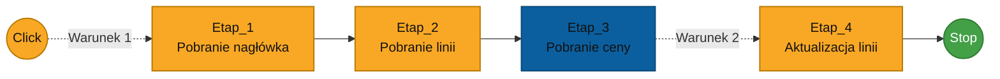

# Przykłady definiowania algorytmów

Poniższe przykłady pokazują sposób wykorzystania punktów startu, instrukcji, zmiennych oraz warunków podczas budowania algorytmów.

---

## Przykład 1 - Pobranie ceny

Algorytm pobiera cenę towaru z systemu ERP i zapisuje ją w atrybucie linii dokumentu.

### Założenia

Dla klasy `Zamówienia` zdefiniowane są:

- atrybut nagłówka `PH` - kod partnera handlowego,
- atrybut linii `TOWAR` - kod towaru zgodny z ERP,
- atrybut linii `CENA` - cena towaru,
- atrybut linii `ILOSC` - ilość.

Na liniach klasy należy również zdefiniować wyzwalacz:

```text
GETPRICE_BT
```

### Diagram




### Click

Punkt startu typu **Click** uruchamia algorytm po użyciu wyzwalacza.

### Warunek 1

Przejście do `Etap_1` posiada warunek:

```text
EVENTARGS[ITEMCODE] = "GETPRICE_BT"
```

Warunek powoduje wykonanie algorytmu tylko dla wyzwalacza `GETPRICE_BT`.

### Etap_1

Instrukcja pobiera dane nagłówka dokumentu.

- `Rodzaj instrukcji` - **Obsługa linii dokumentu**,
- `Typ rozkazu` - `Pobranie nagłówka`,
- `Nazwa` - Etap_1,
- `Opis` - Pobranie nagłówka
- `Zmienna` - `HDR`.

Dane nagłówka są zapisywane do zmiennej tabelarycznej `HDR`.

### Etap_2

Instrukcja pobiera linie dokumentu.

- `Rodzaj instrukcji` - **Obsługa linii dokumentu**,
- `Typ rozkazu` - `Pobranie linii`,
- `Nazwa` - Etap_2,
- `Opis` - Pobranie linii,
- `Zmienna` - `LINES`.

Dane linii są zapisywane do zmiennej tabelarycznej `LINES`.

### Etap_3

Instrukcja pobiera cenę towaru z systemu ERP.

- `Rodzaj instrukcji` - **Obsługa skryptu**,
- `Nazwa` - Etap_3,
- `Opis` - Pobranie ceny,
- `Zmienna` - `SQL`,
- `Skrypt` - przykłądowy skrypt:

```sql
declare 
    @cc nvarchar(100),
    @qty float,
    @lineid int,
    @item nvarchar(100);

select top 1
    @cc = PH
from #HDR;

select top 1
    @cc = SValue
from dbo.strexplode('<!>', @cc);

select
    @lineid = LINEID
from #EVENTARGS;

select
    @item = TOWAR,
    @qty = isnull(ILOSC, 0)
from #LINES
where SYS_LINEID = @lineid;

if @item is null
begin
    select
        -1 as SYS_LINEID,
        0 as CENA;

    return;
end;

select
    @lineid as SYS_LINEID,
    [$DBNAME].dbo.AFN_GetPrice(@item, @cc, @qty) as CENA;
```

Skrypt korzysta ze zmiennych utworzonych przez wcześniejsze etapy algorytmu:

- `#HDR` - dane nagłówka,
- `#LINES` - dane linii,
- `#EVENTARGS` - dane zdarzenia uruchamiającego algorytm.

Wynik zapisany do zmiennej `SQL` zawiera:

- `SYS_LINEID` - ID linii przeznaczonej do aktualizacji,
- `CENA` - cena pobrana z ERP.

:::note
Przykładowy skrypt dotyczy integracji z SAP Business One.
:::

### Warunek 2

Przejście do `Etap_4` posiada warunek:

```text
SQL[SYS_LINEID] >= "0"
```

Warunek powoduje wykonanie aktualizacji tylko wtedy, gdy zmienna `SQL` zawiera poprawne `SYS_LINEID`.

### Etap_4

Instrukcja aktualizuje cenę w odpowiedniej linii dokumentu.

- `Rodzaj instrukcji` - **Obsługa linii dokumentu**,
- `Typ rozkazu` - `Aktualizacja linii`,
- `Nazwa` - Etap_4,
- `Opis` - Aktualizacja linii,
- `Zmienna` - `SQL`.

Zmienna `SQL` jest zmienną wejściową utworzoną w `Etap_3` i zawiera:

- `SYS_LINEID` - ID aktualizowanej linii,
- `CENA` - wartość ceny pobraną z ERP.

---

### Punkt końca

Punkt końca zamyka ścieżkę algorytmu po wykonaniu `Etap_4`.

## Uwagi

- Właściwości dokumentu oraz zmienne typu `Data` są w algorytmach reprezentowane jako tekst.