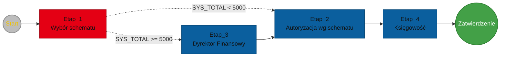

# Przykłady definiowania procesów

Poniższe przykłady pokazują sposób wykorzystania etapów autoryzacji, parametrów, zmiennych oraz warunków podczas budowania procesów autoryzacji. 

---

## Przykład 1 - Decyzja + kwota

Proces kieruje dokument do użytkownika, który wybiera schemat odpowiedzialny za dalszą autoryzację. Jeżeli kwota dokumentu jest większa lub równa `5000`, dokument przechodzi dodatkowo przez etap autoryzacji dyrektora finansowego. Na końcu dokument trafia do księgowości.

### Założenia

- Proces wykorzystuje systemowe pole `SYS_TOTAL` zawierające wartość brutto dokumentu.
- Zdefiniowane są schematy autoryzacji:
  - `ZAM_SERWIS`,
  - `ZAM_SERWIS_2`.
- Zdefiniowana jest grupa użytkowników `DZIAL_FIN`.
- Zdefiniowana jest grupa użytkowników `DEM_KSG`.

### Diagram



### Start

Punkt startu inicjuje proces autoryzacji.

### Etap_1

Pierwszy etap jest wykonywany przez osobę inicjującą proces (owner). Podczas autoryzacji użytkownik wybiera schemat, który zostanie wykorzystany w dalszej części procesu.

- `Rodzaj autoryzacji` - **Autoryzacja parametryzowana**.

Właściwości ogólne:

- `Nazwa` - `ETAP_1`,
- `Opis` - `Wybranie schematu`,
- `Typ` - `Użytkownik zdefiniowany`,
- `Obiekt` - `(owner)`,
- `Zmienna` - `0`,
- `Auto zapis` - niezaznaczony,
- `Dodatkowe informacje` - `Określ prawidłowy schemat`.

Parametr:

- `Rodzaj` - `Wybór schematu`,
- `Nazwa` - `PSCH`,
- `Opis` - `Parametr ze schematem`,
- `Zezwalaj na null` - niezaznaczony,
- `Zmienna` - `ETAP_1.PSCH`,
- `Typ` - `Grupa własna`,
- `Wartości`:
  - `ZAM_SERWIS`,
  - `ZAM_SERWIS_2`.

Wybrany schemat zostaje zapisany do zmiennej `ETAP_1.PSCH`.

### Warunek 1

Jeżeli wartość systemowego pola `SYS_TOTAL` jest mniejsza niż `5000`, proces przechodzi do `Etap_2`.

```text
DOC.SYS_TOTAL < "5000"
```

### Etap_2

Etap wykonuje autoryzację na podstawie schematu wybranego w `Etap_1`.

- `Rodzaj autoryzacji` - **Autoryzacja prosta**,
- `Nazwa` - `ETAP_2`,
- `Opis` - `Autoryzacja wg schematu`,
- `Typ` - `Schemat`,
- `Obiekt` - zmienna `ETAP_1.PSCH`,
- `Zmienna` - `0`,
- `Auto zapis` - niezaznaczony,
- `Dodatkowe informacje` - `Zautoryzuj`.

Po zakończeniu etapu proces przechodzi bezwarunkowo do `Etap_4`.

### Warunek 2

Jeżeli wartość systemowego pola `SYS_TOTAL` jest większa lub równa `5000`, proces przechodzi do `Etap_3`.

```text
DOC.SYS_TOTAL >= "5000"
```

### Etap_3

Etap wymusza dodatkową autoryzację dyrektora finansowego.

:::note
Zamiast przypisywać w procesie konkretnego użytkownika, wykorzystywany jest schemat `DZIAL_FIN` oparty na grupie `DZIAL_FIN`. Grupa zawiera użytkownika pełniącego rolę dyrektora finansowego.

Takie rozwiązanie pozwala zmienić osobę pełniącą tę rolę bez modyfikowania procesu. W przypadku zmiany dyrektora wystarczy zaktualizować skład grupy `DZIAL_FIN`.
:::

- `Rodzaj autoryzacji` - **Autoryzacja prosta**,
- `Nazwa` - `ETAP_3`,
- `Opis` - `Dyrektor Finansowy`,
- `Typ` - `Schemat zdefiniowany`,
- `Obiekt` - `DZIAL_FIN - jeden z DZIAL_FIN`,
- `Zmienna` - `0`,
- `Auto zapis` - niezaznaczony,
- `Dodatkowe informacje` - `Kwota faktury jest wyższa niż 5000. Proszę o autoryzację.`

Po zakończeniu etapu proces przechodzi bezwarunkowo do `Etap_2`.

### Etap_4

Etap wykonuje autoryzację dokumentu przez księgowość.

- `Rodzaj autoryzacji` - **Autoryzacja prosta**,
- `Nazwa` - `ETAP_4`,
- `Opis` - `Księgowość`,
- `Typ` - `Schemat zdefiniowany`,
- `Obiekt` - `DEM_KSG - jeden z DEM_KSG`,
- `Zmienna` - `0`,
- `Auto zapis` - niezaznaczony,
- `Dodatkowe informacje` - `Proszę o autoryzację dokumentu przez księgowość.`

Po zakończeniu etapu proces przechodzi bezwarunkowo do punktu końca **Zatwierdzenie**.