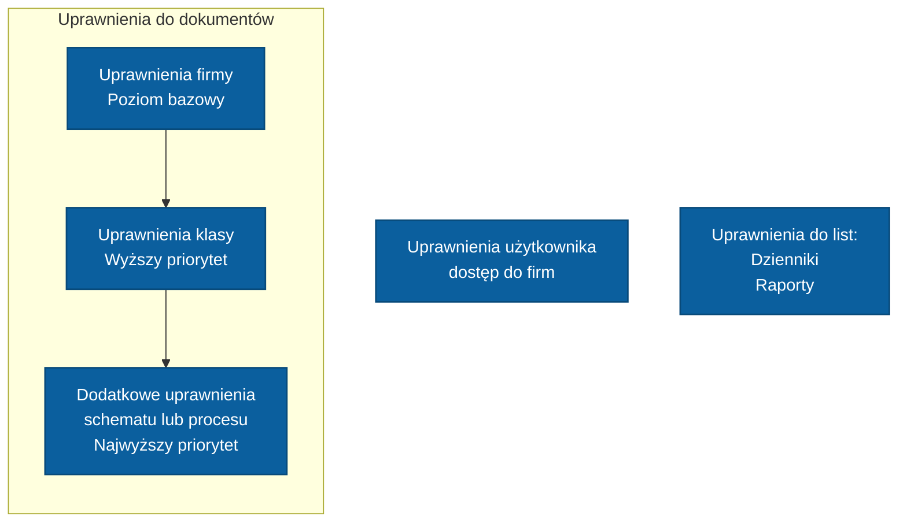

# Uprawnienia

Uprawnienia w SPUMA sterują dostępem do dokumentów oraz możliwością wykonywania operacji na dokumentach, ich atrybutach i liniach.

## Rodzaje uprawnień

Mechanizm uprawnień obejmuje trzy niezależne obszary:

- **uprawnienia do dokumentów**,
- **uprawnienia użytkownika do firm**,
- **uprawnienia do list**.

---

### Uprawnienia do dokumentów

Uprawnienia dotyczące dokumentów są sprawdzane hierarchicznie i mogą być nadpisywane na kolejnych poziomach.

Kolejność:

1. **Uprawnienia firmy**,
2. **Uprawnienia klasy**,
3. **Dodatkowe uprawnienia schematu lub procesu autoryzacji**.

Uprawnienia zdefiniowane na poziomie klasy nadpisują odpowiadające im uprawnienia firmy.

Uprawnienia zdefiniowane w schemacie lub procesie autoryzacji nadpisują odpowiadające im uprawnienia klasy i firmy.

---

### Kolejność uprawnień

Uprawnienia tworzą listę, której kolejność pozycji ma znaczenie.

Wpisy są sprawdzane kolejno od góry do dołu. Jeżeli kilka wpisów dotyczy tego samego użytkownika lub grupy, wpis znajdujący się niżej może **nadpisać** uprawnienie ustawione wcześniej.

Kolejność wpisów można zmieniać. W tym celu należy zaznaczyć wybrane uprawnienie i użyć strzałek dostępnych na liście.

:::note
Znaczenie ma zarówno hierarchia poziomów:

**Firma → Klasa → Schemat / Proces**

jak i kolejność wpisów na liście w ramach danego poziomu.
:::

Przykład:

1. Na poziomie **Firmy** wszyscy użytkownicy otrzymują pełny dostęp do dokumentów.
2. Na poziomie **Klasy** grupa **Księgowość** otrzymuje brak dostępu.
3. Niżej na liście uprawnień klasy użytkownik **X**, należący do grupy **Księgowość**, otrzymuje dostęp do podglądu.
4. Wpis użytkownika **X** jest sprawdzany później i nadpisuje wcześniejsze uprawnienia.

W rezultacie użytkownik **X** ma dostęp do podglądu dokumentów tej klasy, mimo że na poziomie **Firmy** nadano pełne uprawnienia, a na poziomie grupy **Księgowość** brak uprawnień.

---

## Pola konfiguracji uprawnień

Uprawnienia są definiowane za pomocą zestawu pól określających zakres oraz sposób działania danego wpisu.

### Typ

Pole `Typ` określa rodzaj uprawnienia. Dostępne wartości zależą od miejsca konfiguracji.

- **Główne**
  - **Opis:** określa podstawowy dostęp do obiektu oraz możliwość jego podglądu lub edycji.
  - **Występowanie:** Firma, Klasa, Schemat / Proces, Dziennik.

- **Przenaszalność**
  - **Opis:** określa możliwość przenoszenia dokumentu do innego katalogu oraz usuwania dokumentów, które opuściły sekretariat, czyli przenoszenia ich do kosza.
  - **Wyjątek:** właściciel dokumentu może usunąć odrzucony dokument niezależnie od tego uprawnienia.
  - **Występowanie:** Firma, Klasa, Schemat / Proces.

- **Edycja obcych komentarzy**
  - **Opis:** określa możliwość dodania wpisu do komentarza dodanego przez innego użytkownika.
  - **Występowanie:** Firma, Klasa.

- **Edycja pola/kolumny**
  - **Opis:** określa możliwość edycji wskazanego pola lub kolumny.
  - **Występowanie:** Firma, Klasa, Dziennik.

- **Edycja obcych linii**
  - **Opis:** określa możliwość edycji linii dokumentu utworzonych przez innych użytkowników.
  - **Występowanie:** Firma, Klasa, Schemat / Proces.

- **Zmiana zasobów**
  - **Opis:** określa możliwość edycji stron dokumentu.
  - **Występowanie:** Firma, Klasa, Schemat / Proces.

- **Tworzenie dok. SAP**
  - **Opis:** określa możliwość tworzenia dokumentu SAP na podstawie dokumentu w SPUMA.
  - **Występowanie:** Firma, Klasa.

- **Dodanie wpisu dziennika**
  - **Opis:** określa możliwość dodawania nowych wpisów do dziennika.
  - **Występowanie:** Dziennik.

- **Usunięcie wpisu dziennika**
  - **Opis:** określa możliwość usuwania wpisów z dziennika.
  - **Występowanie:** Dziennik.

- **Edycja referencji**
  - **Opis:** określa możliwość edycji referencji powiązanych z wpisem dziennika.
  - **Występowanie:** Dziennik.

### Status

Pole `Status` określa status dokumentu, dla którego obowiązuje dane uprawnienie.

Dostępne wartości:

- **Zatwierdzony** - dokumenty, które zostały zatwierdzone, oraz dokumenty, które nie wymagają zatwierdzania i opuściły sekretariat.
- **Odrzucony** - dokument w statusie `odzrocone`.
- **W sekretariacie** - dokument znajdujący się jeszcze w sekretariacie.
- **W autoryzacji** - dokument znajdujący się w trakcie autoryzacji, w statusie `oczekuje`.

### Schemat

Określa schemat/proces autoryzacji, dla którego obowiązuje wpis uprawnienia.

Pole pozwala ograniczyć działanie uprawnienia do dokumentów obsługiwanych przez wskazany schemat.

### Pole

Określa pole lub atrybut, którego dotyczy uprawnienie.

W zależności od konfiguracji można wskazać:

- konkretne pole,
- wszystkie pola.

Jeżeli uprawnienie nie dotyczy pojedynczego pola, wartość może odnosić się do całego dokumentu lub całej grupy pól.

### Obiekt

Pole `Obiekt` określa obiekt, którego dotyczy dane uprawnienie.

Może wskazywać:

- użytkownika,
- grupę użytkowników,
- w przypadku schematu lub procesu autoryzacji - konkretny etap schematu lub procesu.

### Edycja

Pole `Edycja` określa poziom dostępu nadawany przez dane uprawnienie.

W zależności od typu uprawnienia pole może mieć formę:

- listy wyboru,
- pola typu checkbox.

Dla listy wyboru dostępne są wartości:

- **Pełne** - pełny dostęp do operacji objętej uprawnieniem,
- **Podgląd** - dostęp tylko do podglądu,
- **Brak** - brak dostępu.

W przypadku checkboxa zaznaczenie pola oznacza nadanie danego uprawnienia, a odznaczenie jego brak.

---

